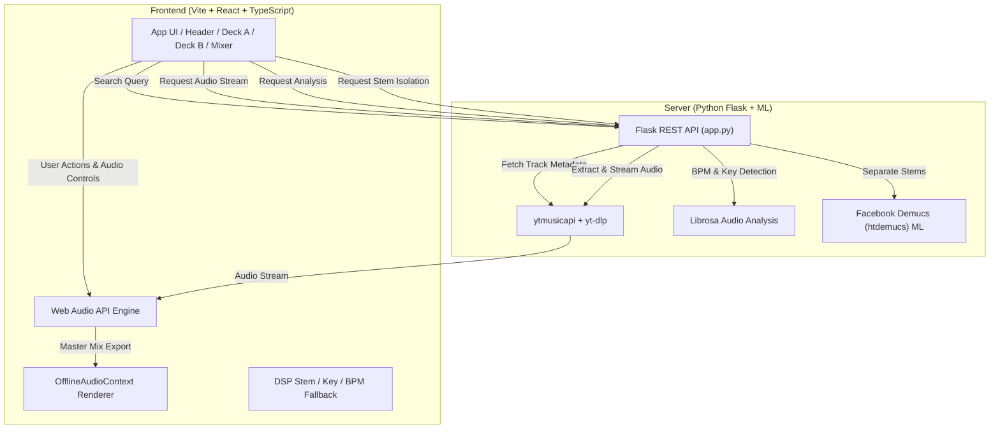

# 🎧 HarmonicBlend — AI-Powered DJ & Stem Mashup Workstation


**HarmonicBlend** is an advanced, web-based DJ & stem mashup workstation designed for real-time harmonic mixing, stem isolation, track analysis, and seamless audio blending. Powered by a high-performance **Vite + React + TypeScript** frontend and a **Python Flask** machine-learning backend, HarmonicBlend gives DJs and music enthusiasts studio-grade tools directly inside the browser.

---

## ✨ Features Overview

### 🔍 Real-Time YouTube Music Integration
- **Search & Load**: Instant search via `ytmusicapi` with high-resolution album artwork, track duration, and artist info.
- **Direct Audio Streaming**: On-demand audio extraction and streaming via `yt-dlp`.

### 🤖 AI-Powered Stem Isolation
- **Meta Demucs ML Model**: High-fidelity separation of tracks into **Vocals** and **Instrumental (Beat)** using Facebook's state-of-the-art `htdemucs` neural network.
- **DSP Mid-Side Fallback**: Instant fallback to DSP mid-side phase cancellation if ML acceleration is unavailable.

### 🎵 Musical Analysis & Harmonic Alignment
- **Librosa BPM Counter**: Real-time tempo estimation from actual audio samples using librosa's `beat_track` algorithm.
- **Krumhansl-Schmuckler Key Detection**: Chromagram-based key extraction mapped to full **Camelot Wheel** codes (e.g., `8A` = A minor, `5B` = E♭ major).
- **⚡ Snap to Key & BPM**: One-click harmonization that tempo-stretches Deck B and pitch-shifts it to match Deck A's key and BPM seamlessly.

### 🎛️ Dual-Deck DJ Workstation
- **Dual Deck Interface**: **Deck A (Cyan)** and **Deck B (Magenta)** with independent controls.
- **Vinyl Turntable Visualizer**: Interactive spinning HTML5 Canvas turntable with drag-to-scratch physics and rotation feedback.
- **Interactive Waveform Display**: Visual audio canvas featuring scrubbing, zoom, playhead tracking, and cue-point indicators.
- **Cue Points**: Set, view, and jump instantly to custom memory cues per deck.

### 🎚️ Pro Audio Controls & DSP Effects
- **3-Band Equalizer**: Dedicated High-shelf, Mid-peak, and Low-shelf filters per deck.
- **Filter Sweep**: Bi-directional Lowpass / Highpass sweep node per deck.
- **Equal-Power Crossfader**: Smooth sinusoidal ($\cos / \sin$) equal-power crossfading curve.
- **Pitch & Tempo Adjustments**: Real-time `playbackRate` control (0.5x to 2.0x) and pitch shifting (-12 to +12 semitones).
- **Gain & Master Controls**: Individual channel gain faders + global master volume.

### 💾 Local Upload & Mix Export
- **Local File Upload**: Drag-and-drop local `.mp3` or `.wav` files directly onto either deck turntable.
- **Offline WAV Renderer**: High-speed audio render via Web Audio `OfflineAudioContext` to export your live performance as a uncompressed `.wav` file.

---

## 📐 System Architecture



### 📂 Directory Structure

```
harmonic-blend/
├── src/                          # React / TypeScript Frontend Application
│   ├── audio/
│   │   ├── AudioEngine.ts        # Primary Web Audio API Graph & Playback Engine
│   │   ├── BpmKeyAnalyzer.ts     # Client-side fallback BPM & Key Analysis
│   │   ├── StemProcessor.ts      # Client-side DSP Mid-Side Stem Separation
│   │   ├── WavExporter.ts        # OfflineAudioContext Mix Exporter (.wav)
│   │   └── PresetTracks.ts       # Track interface definitions & default presets
│   ├── components/
│   │   ├── Deck.tsx              # DJ Deck UI component (Stems, Pitch, Cue, EQ)
│   │   ├── Mixer.tsx             # Central DJ Mixer (Crossfader, EQs, Gain)
│   │   ├── Header.tsx            # Global Header (Master Volume, Search, Export)
│   │   ├── VinylTurntable.tsx    # Canvas 2D Vinyl turntable with scratch physics
│   │   ├── WaveformCanvas.tsx    # Interactive waveform scrub canvas
│   │   ├── YoutubeSearchModal.tsx # YouTube Music Search Modal dialog
│   │   └── ExportModal.tsx       # Mix WAV export modal
│   ├── types/index.ts            # Core TypeScript interfaces & types
│   └── App.tsx                   # Main Workstation Layout & State management
├── server/
│   ├── app.py                    # Flask Server & Audio Processing API Routes
│   └── venv/                     # Python virtual environment
└── README.md                     # Documentation
```

---

## 🚀 Getting Started

### 📦 Prerequisites

Before running HarmonicBlend, ensure you have the following installed on your system:

- **Node.js**: `v18.0.0` or higher
- **Python**: `v3.11` or higher
- **FFmpeg**: Required by `yt-dlp` and `librosa` for audio transcoding.
  - *macOS*: `brew install ffmpeg`
  - *Ubuntu/Debian*: `sudo apt install ffmpeg`
  - *Windows*: Download binaries via `choco install ffmpeg` or official website.

---

### 💻 Installation & Execution

#### 1️⃣ Clone & Frontend Setup
```bash
# Navigate to the project root
cd /Users/durjoysen/.gemini/antigravity/scratch/harmonic-blend

# Install Node dependencies
npm install

# Start the Vite development server
npm run dev
# Frontend runs at: http://127.0.0.1:5173
```

#### 2️⃣ Backend Setup
In a separate terminal window:

```bash
# Navigate to the server directory
cd server

# Create and activate Python virtual environment
python3 -m venv venv
source venv/bin/activate  # On Windows: venv\Scripts\activate

# Install Python ML & audio processing dependencies
pip install flask flask-cors yt-dlp ytmusicapi librosa numpy soundfile demucs

# Start the Flask API server
python app.py
# Backend API runs at: http://127.0.0.1:5000
```

> [!NOTE]
> On the first stem separation request, Demucs will automatically download the pre-trained `htdemucs` model (~1.5 GB). Subsequent calls will use the cached local weights.

---

## 📡 REST API Reference

The Flask backend provides RESTful endpoints for audio search, streaming, feature analysis, and stem separation.

| Endpoint | Method | Parameters | Description |
| :--- | :--- | :--- | :--- |
| `/api/health` | `GET` | None | Returns backend status, GPU availability, and enabled capabilities. |
| `/api/search` | `GET` | `q` *(string)* | Searches YouTube Music for tracks and returns metadata & album covers. |
| `/api/audio` | `GET` | `id` *(string)* | Downloads/extracts audio for a YouTube video ID and streams audio bytes. |
| `/api/analyze` | `GET` | `id` *(string)* | Analyzes audio to detect actual **BPM** and **Key** (Camelot notation). |
| `/api/stem` | `GET` | `id` *(string)*, `stem` *(vocals\|beat)* | Performs Demucs ML separation and streams the requested isolated stem. |

### Example API Responses

#### `GET /api/health`
```json
{
  "status": "online",
  "demucs_available": true,
  "librosa_available": true,
  "ytmusic_available": true
}
```

#### `GET /api/analyze?id=VIDEO_ID`
```json
{
  "bpm": 128.0,
  "key": "A minor",
  "camelot": "8A",
  "duration": 214.5
}
```

---

## 🎼 Harmonic Mixing & Camelot Wheel Guide

Harmonic blending relies on matching musical keys to create seamless transitions without tonal dissonance. HarmonicBlend uses the **Camelot Wheel** system:

| Key | Camelot Code | Key | Camelot Code |
| :--- | :--- | :--- | :--- |
| **A minor** | `8A` | **C major** | `8B` |
| **E minor** | `9A` | **G major** | `9B` |
| **D minor** | `7A` | **F major** | `7B` |
| **E♭ major** | `5B` | **C♭ minor** | `5A` |

### ⚡ One-Click "Snap to Key & BPM"
When you press **Snap to Key & BPM** on Deck B:
1. HarmonicBlend reads **Deck A's** target BPM and Camelot Key.
2. It calculates the required playback speed ratio:
   $$\text{Speed Ratio} = \frac{\text{BPM}_{\text{Deck A}}}{\text{BPM}_{\text{Deck B}}}$$
3. It determines the necessary semitone shift ($\Delta s$) to bring **Deck B** into harmonic alignment with **Deck A**.
4. The Web Audio engine dynamically updates `playbackRate` and pitch semitones on Deck B.

---

## 🛠️ Troubleshooting & FAQ

> [!WARNING]
> **Issue: `ffmpeg` not found error when searching/playing YouTube tracks**
> **Solution**: Ensure `ffmpeg` is installed on your system PATH. Verify by executing `ffmpeg -version` in your terminal.

> [!TIP]
> **Issue: Stem separation is taking a long time on first run**
> **Solution**: The Facebook Demucs model downloads its ~1.5 GB neural weights on the first request. Check your terminal output for download progress. Subsequent requests will execute significantly faster.

> [!NOTE]
> **Issue: Web Audio playback blocked by browser**
> **Solution**: Browsers restrict AudioContext auto-start. Click anywhere on the HarmonicBlend UI or press Play to unlock the Web Audio context.

---

## 📄 License

HarmonicBlend is open-source software licensed under the [MIT License](LICENSE).

---

<p center>
  Crafted with ❤️ for DJs, Producers, and AI Music Enthusiasts.
</p>
